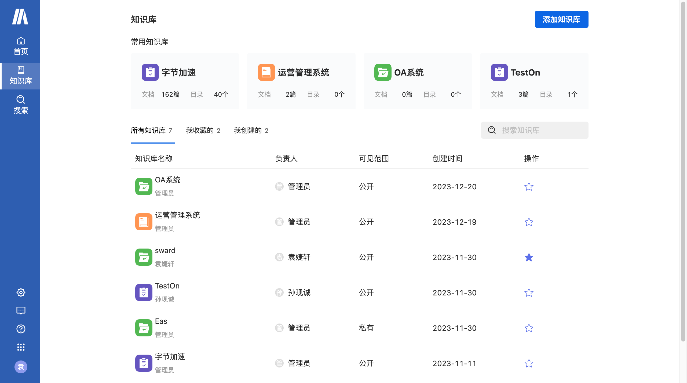
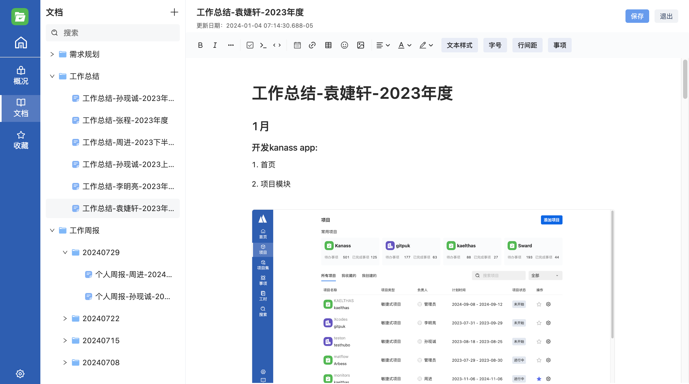
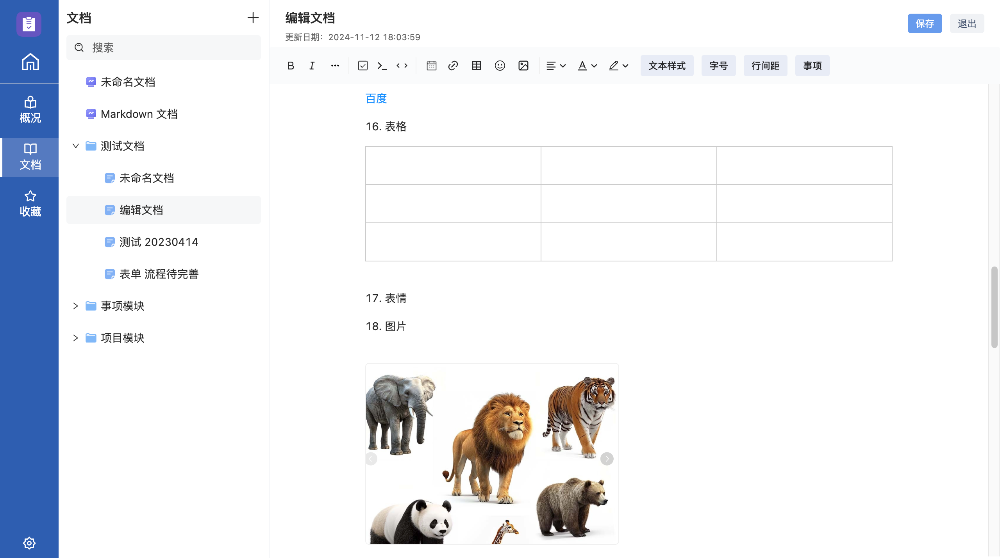
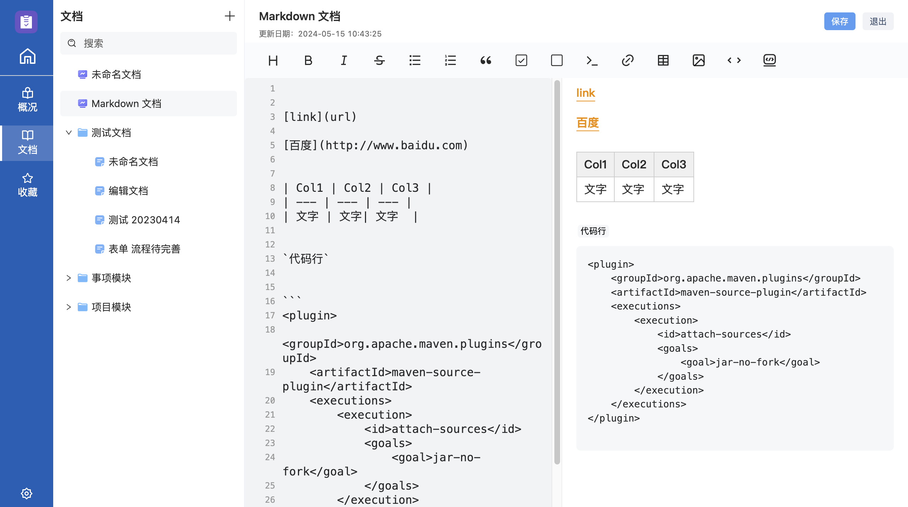
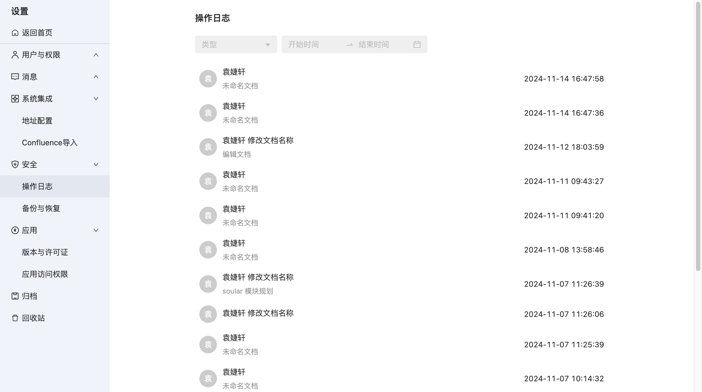

# 项目管理工具——Kanass
知识库管理软件是一种用于创建、组织、存储、维护和提供访问知识库的软件系统。

# 1. sward 功能介绍
sward的主要功能有知识库管理、文档管理等。
## 1.1 知识库管理
知识库能集中存储、组织和管理特定领域的知识，拥有独立的成员与权限，保证数据安全。
* 知识库管理
    
    每个知识库可以看做一个独立的项目或团队工作区，里面有目录和文档，方便查找和管理。知识库可以根据项目、团队或部门进行划分，方便管理和查找。

    


* 目录管理

    知识库内部的目录用树形结构展示，明确上下级关系便于管理与查找；目录之间下级文档和下级目录可以相互移动，改变从属关系和顺序，操作方便。
    
    


* 分享

    目录与文档可以批量分享，也可以单独分享。分享的出去的文档不需要登录就可以查看，便于团队之间的资源共享。

* 归档

    不常用的知识库可以归档起来，不在列表中展示，便于常用文档的查找。

* 回收站

    废弃的知识库可以放到回收站，统一删除。在回收站中也可以恢复，避免误删。


* 成员与权限
    
    每个知识库拥有独立的成员与权限管理模块，只用于当前知识库；


## 1.2 文档管理

sward支持多种文档类型，比如富文本、markdown等，适用于多种场景。还提供多种模版，帮助用户快速创建常用文档。而且集成kanass的事项，提高办公效率。还有分享与评论功能，让成员之间可以互相交流。
* 支持两种文档类型

    sward支持富文本、markdown两种文档类型，未来还会持续迭代，支持更多文档类型。

    富文本文档：

    


    Markdown：

    


* 提供多种模板

    系统还内置周报、项目规划和执行、待办工作清单等多种模板，可以帮助用户快速创建常用文档。

* 集成kanass事项

    sward 集成kanass，可以添加kanass事项到文档中，让用户可以快速查看详情

* 收藏

    常用或者重要的文档可以收藏，便于查看。

* 分享与交流

    知识库管理软件为员工提供了一个共享和交流知识的平台，可以通过评论、点赞、分享等方式实现知识的共享和讨论

* 归档

    不常用的文档或者不用的文档可以归档起来，不在目录树中展示，便于常用文档的查找

* 回收站

    不用的文档和目录可以放入到回收站，放入回收站的可以恢复或者删除，避免文档问误删。

## 2. sward 的优点

sward 做到了也没简洁，上手容易，安装配置简单。使用备份、日志审计、权限保证数据安全。而且支持多版本多终端，集成开放，免费开源。


## 2.1 简洁易用

界面简洁，可直接使用；安装简单，支持一键式安装。
* 安装配置简单
    
    线下部署版本支持一键式安装，内置数据库，不用单独安装数据库，配置也只需要在一个文件中修改参数就可以；公有云部署版本注册即可使用。

* 系统内置多种模版，零配置使用

    系统内置消息等模版，无需配置，可直接添加您的第一个知识库

* 界面简洁
    
    界面简洁，但是功能丰富，色彩搭配和谐，有助于减轻用户的视觉疲劳


## 2.2 集成开放
可导入confluence数据，集成kanass项目管理系统，并提供OpenApi，便于被第三方集成
* 集成confluence
    
    可以导入confluence，轻松的实现从confluence到sward的数据迁移

* 集成kanass

    集成kanass项目管理，便于查看事项详情，提高工作效率

* openApi

    我们提供openApI接口，用于被第三方应用集成 

## 2.3 安全可靠
系统有多层级权限、备份功能、日志审计多种功能来保证数据安全

* 多层级权限
    
    通过应用级、系统级和项目级权限管理，确保不同角色的成员只能操作在自己职责之内的功能，从而保证系统数据的安全。

* 日志审计

    实时记录重要的操作，便于追溯到具体的用户，确保操作安全。

    

* 备份

    默认定时恢复数据，还可以手动备份，在系统出错的时候能够及时还原数据。

## 2.4 多版本多终端
支持多版本多终端

* 多版本
    
    提供线上公有云版本与私有云部署版本。

* 多终端
    
    sward支持在pc、手机app和h5端使用，在多种场合下都可使用本产品办公。

## 2.5 一站式开发
我们不仅做了知识库管理工具sward，同时还推出了Kanass(项目管理工具)，PostIn(知识库管理工具)，TestHubo(接口管理工具)，Arbess(流水线管理工具)，Gitpuk(代码库管理工具)，Hadess(制品库管理工具），Kaelthas(监控管理工具），这几款产品覆盖了开发测试运维整个软件的生命周期。

* 体系完善
    
    我们的产品矩阵覆盖了软件的整个生命周期，做到了开发测试运维一体化。


* 使用灵活
    
    我们的产品既可以全部安装，使用统一账号体系，也可以单独安装，只使用一个产品，可以自由组合。

## 2.6 免费开源
    
免费开放源代码，通过协作和共享的方式推动项目的发展；


# 3. 下载与演示

* 下载
    
    sward 下载地址：[https://download.tiklab.net/sward](https://download.tiklab.net/sward)

* 演示
    
    sward 演示地址：[https://demo.tiklab.net/sward](https://demo.tiklab.net/sward)

* 使用
    
    公有云版本是进入官网注册一个账号，可用手机号与邮箱注册
    登录进入工作台选择要点击sward，就成功的开通了sward，就可进入系统使用了

# 4. 运行 sward

* 配置npm仓库地址

    ```
    npm config set registry https://mirror.tiklab.net/repository/tiklab-npm
    ```

* 配置后端地址
   
    进入 enviroment/enviroment_local.js 文件

    修改 api 的值为你启动的后端项目 tiklab-sward 的地址


* 启动

    ```
    1. git clone <仓库地址>
    2. cd tiklab-sward-ui
    3. npm install
    4. npm run start
    ```

* 登录
   
   账号：admin
   
   密码：123456


# 5. 需求反馈

如果你有好的建议或发现了问题，请通过以下方式联系我：[联系我们](https://tiklab.net/account/workOrder/add)

如需了解更多信息，请访问我们的[官方地址](https://tiklab.net/)或加入我们的社区讨论：<https://tiklab.net/>

邮箱: tiklab@163.com